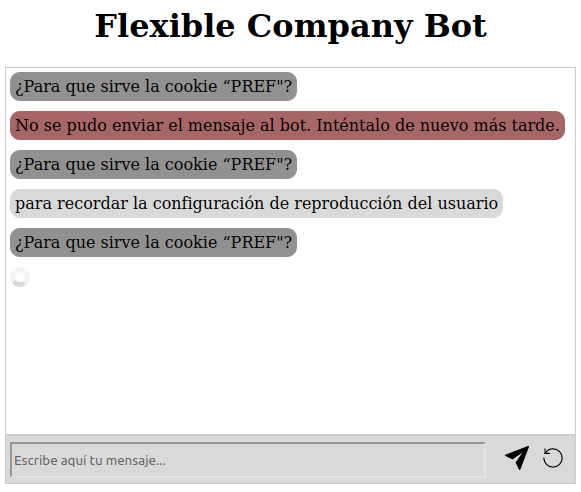
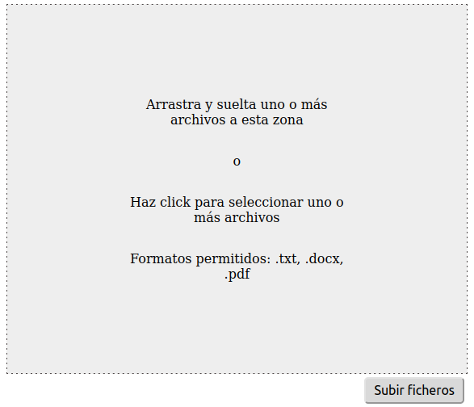
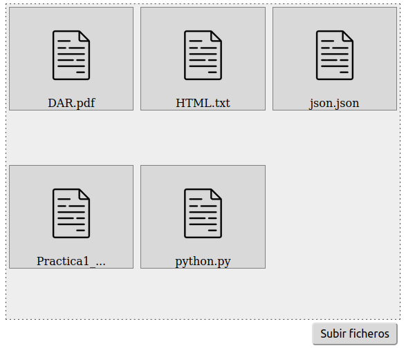

# USC-FlexibleCompanyBot


## Description
FlexibleCompanyBot provides a web component that allows the user to interact with a chatbot. The chatbot is able to answer questions about a preconfigured knowdledge base. 

The project is oriented to use in `Spanish` language, so be aware of that if you want to use it in another language.

It's also provides another web component to upload a file to be added to the knowledge base. At the moment, the only supported formats are `.txt`, `.xml`, `.json`, `.docx` and `.pdf`.

## Requirements
This project has been developed using Python 3.9.16 and Poetry. So, `Python 3` and `pip3` are required.

Make sure also that you have installed Java 11 in your device. You can donwload it using the following command:
```bash
apt-get install openjdk-11-jdk
```

The project also uses JavaScript for the web components. You can install it using Nodejs with the following command:
```bash
apt-get install nodejs
```

## Visuals
In the following images you can see the web components.





## System Installation
For program installation, it is recommended to use an Anaconda environment.

The program can be automatically installed using the bash script `install.bash` with the following command:

```bash
bash install.bash
```
This script creates a Conda environment called FlexibleCompanyBot and installs all the necessary dependencies.

If you prefer to perform a manual installation, dependency management is done with Poetry. You can install it using the following command:
```bash
pip install "poetry-core>=1.1.0a6" "poetry>=1.2.0b3"
```
Before installing the dependencies, a specific version of Pygaggle is required, which can be installed using the following commands. You need to replace `$conda_path` with the path where Anaconda is installed.
```bash
cd "$conda_path/lib/python3.9/site-packages/"
rm -rf pygaggle && $conda_path/bin/pip uninstall -y pygaggle
git clone  --recursive https://github.com/castorini/pygaggle.git
cd pygaggle
pip install install --editable .
```
You can replace `pip` with the package manager you're using

The installation of the necessary packages for running the program is done using Poetry with the following command:
```bash
poetry install
```

It's also necesary to install Grobid 0.7.2, which allows to extract the text from PDF files. You can install it using the following commands in the root directory of the project:
```bash
wget https://github.com/kermitt2/grobid/archive/0.7.2.zip
unzip 0.7.2.zip
rm 0.7.2.zip
```
Now you need to build Grobid. For that, you can use Gradle.
```bash
cd grobid-0.7.2
./gradlew clean install
```

### <a name="issue">Issue</a>
If during the ejecution of the command `poetry install` any dependence fails during installation, you would need to install Rust compiler.
```bash
curl --proto '=https' --tlsv1.2 -sSf https://sh.rustup.rs | sh
```

## Server Installation
I provide a server to test the program. If you want to use it, you can skip this section.
The server is running with Nginx. The installation of Nginx is done with the following command:
```bash
sudo apt-get update
sudo apt-get install nginx
```
Check the status of the server with the following command:
```bash
systemctl status nginx
```
If the server is not running, you can start it with the following command:
```bash
systemctl start nginx
```
Configure /etc/nginx/nginx.conf with the following content:
```bash
user www-data;
worker_processes auto;
pid /run/nginx.pid;
include /etc/nginx/modules-enabled/*.conf;

events {
	worker_connections 1024;
}

http {
	sendfile on;
	tcp_nopush on;
	types_hash_max_size 2048;

	include /etc/nginx/mime.types;
	default_type application/octet-stream;

	ssl_protocols TLSv1 TLSv1.1 TLSv1.2 TLSv1.3; # Dropping SSLv3, ref: POODLE
	ssl_prefer_server_ciphers on;

	access_log /var/log/nginx/access.log;
	error_log /var/log/nginx/error.log;

	gzip on;

	include /etc/nginx/conf.d/*.conf;
	include /etc/nginx/sites-enabled/*;
}
```
Configure /etc/nginx/sites-available/default with the following content:
```bash
server {
    client_max_body_size 100m;
    listen 80;
    listen [::]:80;

    root /var/www/flexiblecompanybot;

    index index.html index.htm index.nginx-debian.html;

    server_name localhost;

    location /upload {
        alias /var/www/flexiblecompanybot/qa_model/dataset/files/new_files;
        dav_methods PUT;
        dav_access group:rw all:r;
    }
}
```

## Permissions
The user www-data needs to have permissions to write in the directory where the files are uploaded. In my case, the directory is /var/www/flexiblecompanybot/qa_model/dataset/files/new_files. Also, the user which runs the FastAPI server needs to have permissions to move these files. This incompatibility can be solved creating a group with both users and giving permissions to the group. In my case, the group is called flexiblecompanybot and the users are www-data and my user. So, I run the following commands:
```bash
# Create the group
sudo groupadd flexiblecompanybot
# Add the users to the group
sudo usermod -a -G flexiblecompanybot my-user
sudo usermod -a -G flexiblecompanybot www-data
# Give permissions to the group
sudo chgrp -R flexiblecompanybot /var/www/flexiblecompanybot/qa_model/dataset/files/new_files
sudo chmod -R g+w /var/www/flexiblecompanybot/qa_model/dataset/files/new_files
# Activate setgid bit to herit the group permissions to the new files
sudo chmod g+s /var/www/flexiblecompanybot/qa_model/dataset/files/new_files
``` 

## Usage
First of all, you need to activate the Conda environment:
```bash
conda activate FlexibleCompanyBot
```
Then, you need to run the FastAPI server. Firts you need to go to the directory where the file `api.py` is located and then run the uvicorn server with the following command:
```bash
cd qa_model
uvicorn api:app --reload
```

Now, if you have your server running, you can access to your index.html file and start using the chatbot. You can see an example of usage in the file [example/index.html](example/index.html).

To use the web components, first you must import JQuery in your html file. You can do it with the following code:
```html
<script src="https://code.jquery.com/jquery-3.6.0.min.js"></script>
```

Then you need to import them in your html file. In "src" you need to put the path where the web components are located.
```html
<script type="module" src="web-components/flexible-company-bot/FlexibleCompanyBot.js"></script>
<script type="module" src="web-components/upload-file/FileUploader.js"></script>
```
Then, you can add the components in your html file. The file-uploader component needs to have the server_url attribute with the url of the server where the files are uploaded.
```html
<flexiblecompanybot-component></flexiblecompanybot-component>
<file-uploader server_url="http://localhost"></file-uploader>
```
